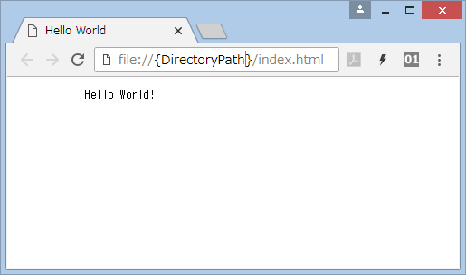
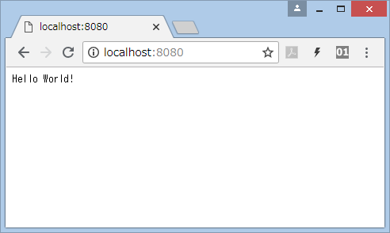
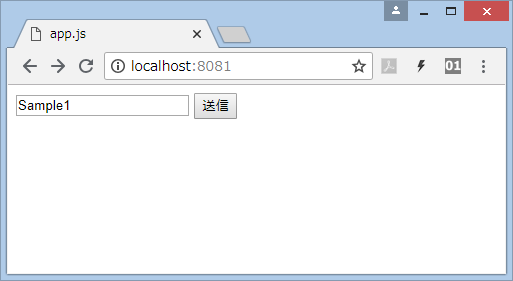
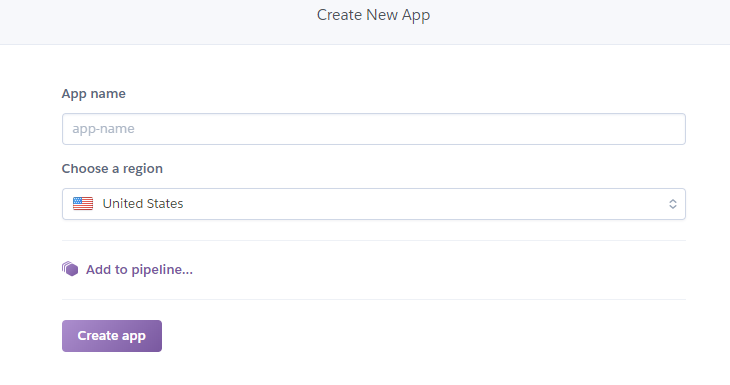

name: inverse
layout: true
class: center, middle, inverse
---
# Node.js入門

---
layout: false
class: center, middle


---
## 対象者

* Node.js未経験者
* サーバーサイド未経験者

---
layout: true
## 前提知識

---
### JavaScript

* 動的型付のスクリプト言語  
* Webブラウザ上で動作する  
* Javaとは無関係  

---
### クライアントサイド

* クライアント側( = Webブラウザ)で動作するもの
* フロントエンド

### サーバーサイド

* Webサーバーで動作するもの
* クライアントからのリクエストを処理する
* バックエンド

---
layout: false
class: center, middle, inverse
# Node.jsとは

---

layout: true
## Node.jsとは

---

### サーバーサイドのJavaScript実行環境

* 通常クライアントサイドで実行されるJavaScriptを、サーバーサイド開発に使用したもの
* 軽量で効率よくリクエストを処理

---

### アーキテクチャ

* ノンブロッキングI/O
    * 複数のプロセスを同時実行
    * ステータスを定期的に確認している(非同期とは異なる)
　　
* イベントループ
    * イベントを待機するループ機能を持つ
    * 発生したイベントはイベントキューに入れられ、順次取り出される
    * イベントに対する処理はコールバック関数を使用

---
layout: false
## インストール  

公式サイト  
[http://nodejs.org/](http://nodejs.org/)

バージョンの確認

```console
$ node -v
```

---
class: center, middle, inverse
# サンプル

---
layout: true
## "Hello World"

---
### 通常のJavaScript(クライアントサイド)

hello.js

```javascript
document.writeln('Hello World!');
```

index.html

```html
<!DOCTYPE html>
<html>
    <head>
        <meta charset="utf-8">
        <title>Hello World</title>
    </head>
    <body>
        <pre>
            <script src="hello.js"></script>
        </pre>
    </body>
</html>

```

---
### 通常のJavaScript(クライアントサイド)

実行(ダブルクリック)



---
### Node.js(コンソール)

sample1.js
```javascript
console.log("Hello world!");
```

実行

```console
$ node sample1.js
Hello world!
```

---
### Node.js(サーバーサイド)

sample2.js

```javascript
var http = require('http');
var server = http.createServer(function(req, res) {
  res.write("Hello World!\n");
  res.end();
}).listen(8080);
```

実行

```console
$ node sample2.js
```

---
### Node.js(サーバーサイド)

localhost:8080 にアクセス




---
layout: false
class: center, middle, inverse
# パッケージ管理

---
layout: true
## npm

---
### Node.jsのパッケージ管理ツール

* Github等で公開されているライブラリパッケージを導入するためのツール
    Nuget や gem のようなもの
  
* Node.jsをインストールすると標準でついてくる  
    (アンインストールすると消えるので注意)  
* 最近では yarn の方が主流？  
    [https://yarnpkg.com/ ](https://yarnpkg.com/ )

---

バージョンの確認

```console
$ npm -v
```

パッケージのインストール

```console
$ node install -g パッケージ名
```

-g はグローバルインストールのオプション。付けない場合はカレントディレクトリにインストールされる

---
layout: false
class: center, middle, inverse
# フレームワーク

---
layout: true
## Express.js

---
### Node.jsアプリケーション向けの高速で最小限のWebフレームワーク

* Node.js開発では主流  
* 主な機能
    * ルーティング  
        パスと処理の関連付けが容易  
    * テンプレートエンジン  
        「ejs」「ect」「haml」「jade」  
    * アプリのひな型を自動生成

インストール

```console
$ npm install express
```

---
layout: false
class: center, middle, inverse
# 新規作成からデプロイまで

---
## 新規作成

フォルダを作成

```console
$ mkdir ~/myapp
$ cd ~/myapp
```

package.json を作成

```console
$ npm init
```

---
## インストール

Expressパッケージ

```console
$ npm install express
```

リクエストのbodyパーサー

```console
$ npm install body-parser
```

---
## 実行ファイル

### sample.js, Procfile

ファイルを作成し、以下の内容をコピー  
[sample.js](sample.js)

[Procfile](Procfile)

---
## テスト

Webサーバーを起動

```console
$ node sample.js
```

 localhost:8080 にアクセス



---
## Heroku

アカウントの作成  
[https://www.heroku.com/](https://www.heroku.com/)

  
Heroku CLIのインストール  
[https://devcenter.heroku.com/articles/heroku-cli](https://devcenter.heroku.com/articles/heroku-cli)

---
## webappの新規作成

Heroku ダッシュボードの右上にある「New」→「Create new app」  



ユニークなapp-nameをつける

---
## ログイン

myappフォルダ内

```console
$ heroku login
```

---
## Git

リポジトリの作成

```console
$ git init
$ heroku git:remote -a webapp名
```

 .gitignore ファイルを作成し、以下の内容をコピー  

```console
node_modules/
```

コミット

```console
$ git add .
$ git commit -m "make it better"
```

---
## デプロイ

```console
$ git push heroku master
```

https://webapp名.herokuapp.com/ にアクセス

---
## おわりに

Webに関する理解を深めるためには、サーバーの応答の仕組みを知ることも大事だと思います。  
Node.jsはライブラリが豊富で簡単に始められるので、まだサーバーサイド開発に触れたことがない方はNode.jsを使ってみてはどうでしょうか。

---
## 参考  
Node.js入門  
[http://www.tohoho-web.com/ex/nodejs.html](http://www.tohoho-web.com/ex/nodejs.html)

基礎から学ぶNode.js  
[http://gihyo.jp/dev/serial/01/nodejs](http://gihyo.jp/dev/serial/01/nodejs)

Wikipedia  
[https://ja.wikipedia.org/wiki/Node.js](https://ja.wikipedia.org/wiki/Node.js)

Node.jsのフレームワーク「Express」とは【初心者向け】  
[https://techacademy.jp/magazine/16119](https://techacademy.jp/magazine/16119)

Node.jsのMVCフレームワーク「Express」の基礎知識とインストール  
[http://www.atmarkit.co.jp/ait/articles/1503/04/news047.html](http://www.atmarkit.co.jp/ait/articles/1503/04/news047.html)